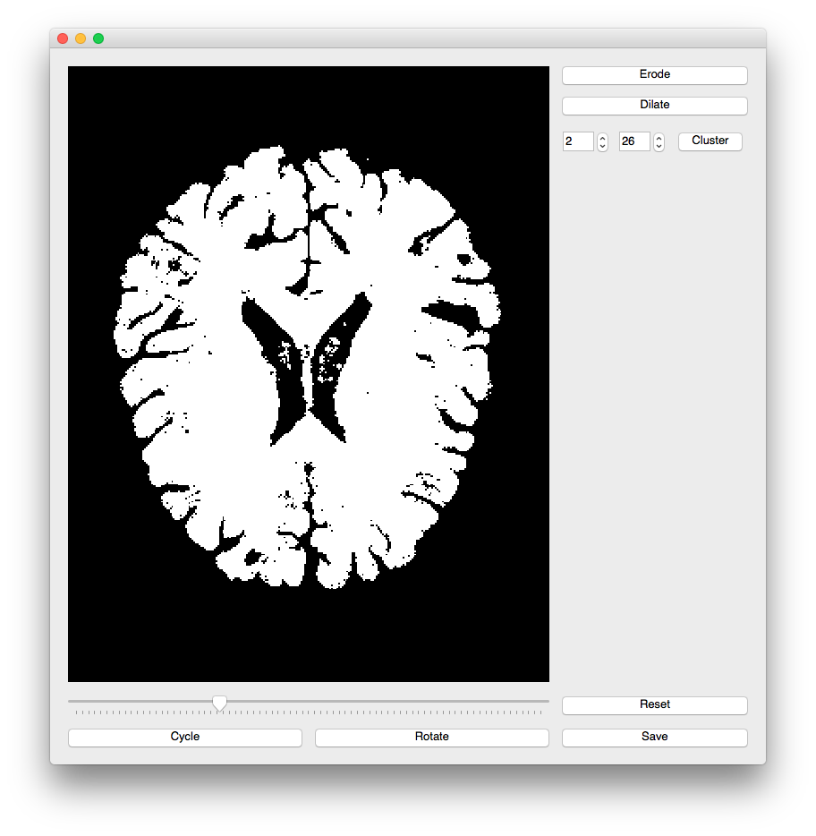

# Morphology Viewer

[WIP] The aim is to provide an easy way of visualizing basic morphology operations
such as erosion and dilation using the excellent pyqt graph interface.

## Core dependencies
[**Python 3.5**](https://www.python.org/download/releases/3.5/)

| Package                                   | Tested version |
|-------------------------------------------|----------------|
| [NumPy](http://www.numpy.org/)            | 1.14.1         |
| [Scipy](https://www.scipy.org/)           | 1.0.0          |
| [NiBabel](http://nipy.org/nibabel/)       | 2.2.1          |
| [Pyqtgraph](http://www.pyqtgraph.org/)    | 0.10.0         |
| [scikit-image](http://scikit-image.org)   | 0.13.1         |
| [pyqt](https://en.wikipedia.org/wiki/PyQt)| 4.11.4         |

## Installation & Quick Start

### create virtual environment (optional)
`conda create --name envMorphViewer python=3.5`

`source activate envMorphViewer`

`conda install pip`

### install basics
`pip install numpy scipy nibabel`

### install pyqtgraph
`conda install -c anaconda pyqtgraph=0.10.0`

### install scikit-image
`conda install -c anaconda scikit-image`

### install PyQt4
`conda install pyqt=4`

### install pyOpenGL (optional)
`pip install PyOpenGL PyOpenGL_accelerate`

### clone repository
`cd home/user/git/`

`git clone https://github.com/MSchnei/morphViewer.git`
